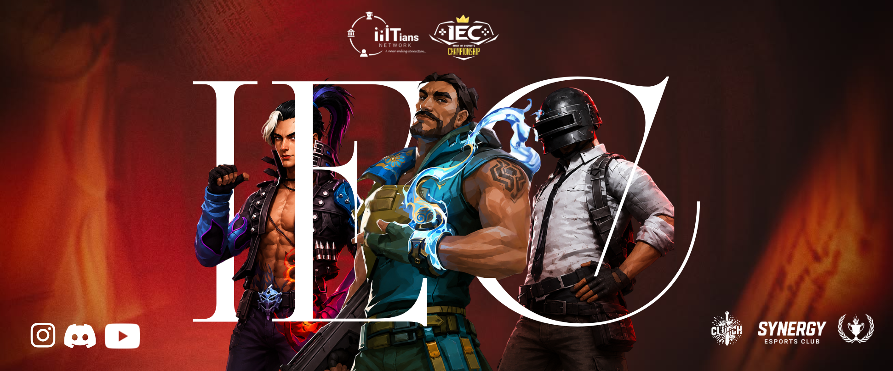

  
  <h1>🎮 InterIIIT Esports Championship</h1>
 

## About the Event

The InterIIIT Esports Championship is where the brightest gaming talent from IIITs across India comes together for an unforgettable showdown. It is more than just a tournament — it is a platform for teams to compete, connect, and represent their colleges with passion.

From intense matches to unforgettable moments, this event brings together:

- Competitive gaming at its best
- A vibrant community of student players and supporters
- The energy of college pride and friendly rivalry
- A chance to shine on a national stage

## What to Expect

Expect fast-paced action, high-level strategy, and the kind of excitement that turns every match into a story worth talking about. Whether you are playing, cheering, or simply soaking in the atmosphere, this event is designed to be thrilling from start to finish.

## Why It Matters

The championship is a celebration of talent, teamwork, and the growing esports culture in Indian institutions. It gives players a chance to showcase their skills while bringing together campus communities through a shared love for gaming.

## Join the Action

Be part of the competition, support your college, and experience the spirit of esports at its finest. The stage is set — all that remains is the excitement of the game.

---

  
<strong>Let the games begin.</strong>

